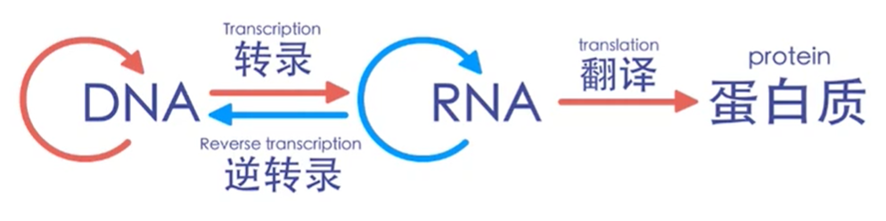
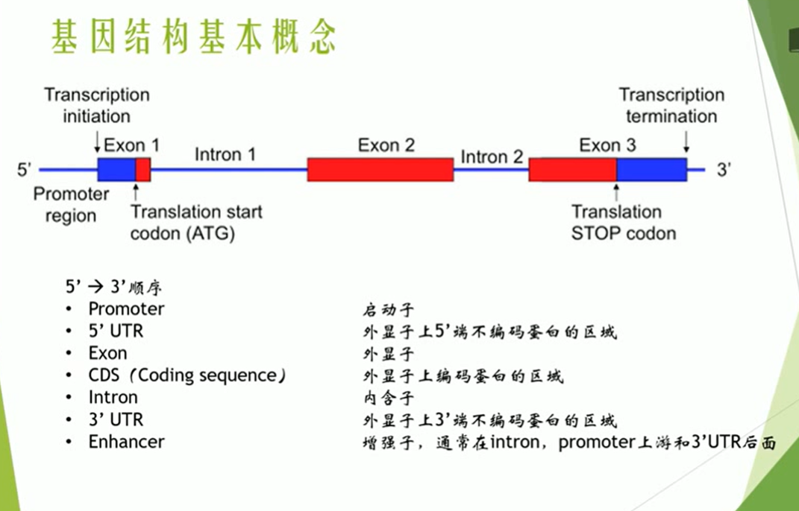
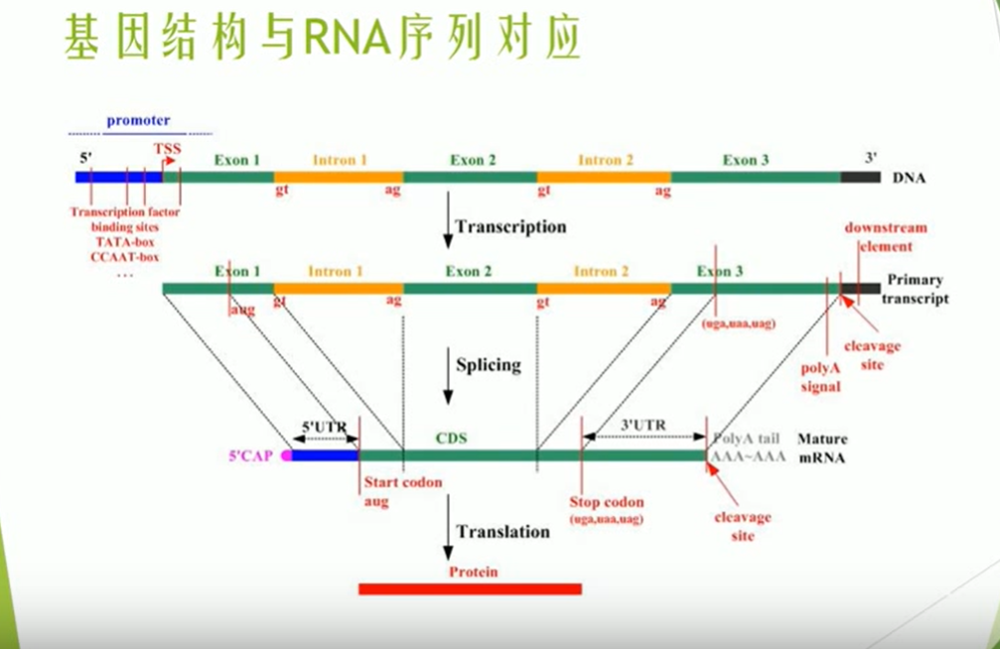

# 分子生物学
---

# 目录
- [实验protocol包](#实验protocol包)
- [课本](#课本)
- [1.认识DNA和RNA](#1认识dna和rna)
  - [中心法则](#中心法则)
  - [真核生物基因结构](#真核生物基因结构)
  - [区分cds和orf](#区分cds和orf)
- [2.NCBI](#2ncbi)
- [3.PCR](#3pcr)
- [4.Touch Down PCR](#4touch-down-pcr)
- [5.RNA核酸提取](#5rna核酸提取)
- [6.RT-PCR](#6rt-pcr)
- [7.荧光定量PCR](#7荧光定量pcr)
- [8.Crispr](#8crispr)
- [9. 质粒构建表达](#9-质粒构建表达)
- [10. snapgene](#10-snapgene)
---

# 实验protocol包
[酸谈实验protocol包](./collections/书籍pdf和视频下载链接.md)

# 课本
[基因工程原理_第二版（上册）](./collections/书籍pdf和视频下载链接.md)  
[基因工程原理_第二版（下册）](./collections/书籍pdf和视频下载链接.md)

# [1.认识DNA和RNA](#目录)
## 中心法则
  

## 真核生物基因结构
 [**区分启动子、终止子、起始密码子、终止密码子**](https://www.bilibili.com/video/BV1CE411G7A4?spm_id_from=333.999.0.0)     
  



## 区分cds和orf
1. CDS是编码一段蛋白产物的序列，是结构基因组学术语。
```
与开放读码框 ORF 的区别：
开放读码框是从一个起始密码子开始到一个终止密码子结束的一段序列；不是所有读码框都能被表达出蛋白产物，或者能表达出占有优势或者能产生生物学功能的蛋白。
CDS，是编码一段蛋白产物的序列。
CDS 必定是一个 ORF。但也可能包括很多 ORF。 反之，每个 ORF 不一定都是 CDS。  
外显子与CDS区也不是完全一致的，CDS区一定属于外显子，但是外显子不一定是CDS区，因为UTR区的存在，即外显子不一定都能翻译成蛋白的。
```

2. ORF 是理论上的氨基酸编码区，一般是在分析基因序列得到的。
```
把基因的mRNA输入到程序，程序会自动在 DNA 序列中寻找启动子（ATG 或 AUG），然后按每 3 个核酸一组，一直延伸寻找下去，直到碰到终止子（TAA 或 TAG）。此时程序就把这个区域当成 一个ORF 区，认为理论上可以编码一组氨基酸。但问题是，在一个mRNA中寻找 ATG 并不靠谱。因为寻找到的 ATG 很可能是相邻两个密码子的尾和头的混合体。

ATGCAGCGTACTC
看上面这个小序列，有三种蛋白质编码组合的可能
（1）ATG | ORF寻找程序会认为这是一个启动子
（2）GCA | 一个普通的序列
（3）TGC | 一个普通的序列
这就是 ORF 三种框架的来源。实际上，DNA 序列可以按六种框架阅读和翻译（每条链三种，对应六种不同的三联密码子）
那么哪一种是正确的呢？这得结合基因的产物（蛋白质）来进行确定

tips：
一个mRNA可能有很多个ORF,不同的ORF长度不一样，有的甚至只有十几个碱基，这很明显就是一个错误的阅读框。我们一般认为最长的哪个是正确的ORF，要真正确定，需要根据蛋白质的序列来查证。
所以，我们说 ORF 只是理论上的编码区，与真实的情景可能并不一样。
```
3. 总结
```
开放阅读框是基因序列的一部分，包含一段可以编码蛋白的碱基序列，遇到终止子结束。当一个新基因被识别，其DNA序列被解读，人们仍旧无法搞清相应的蛋白序列是什麽。这是因为在没有其它信息的前提下，DNA序列可以有六种可能的 ORF ，ORF识别包括检测这六个阅读框架并决定哪一个包含以启动子和终止子为界限的DNA序列而其内部不包含启动子或密码子，符合这些条件的序列有可能对应一个真正的单一的基因产物。ORF的识别是证明一个新的DNA序列为特定的蛋白质编码基因的部分或全部的先决条件。
cds是直接可以翻译成目的蛋白的核酸序列，也就是成熟mRNA中的cds，是我们做目的基因表达需要连入载体的部分。
```
4. 三种ORF开放阅读框预测方法对比
[ORF开放阅读框预测](https://www.bilibili.com/video/BV1GL4y1H7H3?spm_id_from=333.999.0.0)  

# [2.NCBI](#目录)
[解读NCBI基因注释（一）](https://www.bilibili.com/video/BV1PY411n7jU/?spm_id_from=333.788.recommend_more_video.-1)  
[解读NCBI基因注释（二）](https://www.bilibili.com/video/BV18F411s779?spm_id_from=333.851.header_right.history_list.click)  
[解读NCBI基因注释（三）](https://www.bilibili.com/video/BV1jb4y1p7M7/?spm_id_from=333.788.recommend_more_video.0)  
[解读NCBI基因注释（四）](https://www.bilibili.com/video/BV1NL411A7nB?spm_id_from=333.999.0.0)  

[使用gene数据库查找human的actin基因](https://www.bilibili.com/video/BV11t411c7dq?p=2)  
[使用Nucleotide数据库查找IL2基因](https://www.bilibili.com/video/BV11b4y1q76g?spm_id_from=333.999.0.0)  
[使用assembly数据库查找目标物种的参考基因组](https://www.bilibili.com/video/BV1g44y187cL?spm_id_from=333.999.0.0)  
[使用SRA数据库查找原始测序数据](https://www.bilibili.com/video/BV1Dg411K7a1?spm_id_from=333.999.0.0)  


> gene和Nuclrotide数据库都均可用来查找基因  
> 找目的基因氨基酸序列或cds用Nuclrotide，找目的基因的内含子外显子等更多信息用gene  
> 使用assembly数据库查找目标物种的参考基因组  
> 使用SRA数据库查找原始测序数据
> ncbi病毒数据库<https://www.ncbi.nlm.nih.gov/labs/virus/vssi/#/>
> Refseq意为可参考的标准序列  
> Graphics为视图模式；GeneBank序列完整报告；FASTA为整个序列，可以复制下来blast  

> 基因开头字母： **（如果想找标准序列的话，mRNA就采用NM_开头的，基因组用NC_或者AC_开头的。）**  
> - AC_ 表示一些可供选择的注释基因组序列，主要用来标记病毒和原核生物  
> - NC_ 完整的基因组分子序列，标记的类别包括基因组、染色体、细胞器、质粒  
> - NM_ 转录产物序列，成熟mRNA转录本序列  
> - NP_ 蛋白产物，主要是全场转录氨基酸序列，也有部分蛋白质的部分氨基酸序列    
> - NR_ 非编码蛋白的mRNA序列，包括结构RNAs等  
> - XM_ 预测的蛋白编码序列  
> - NT_ 和 NW_ 表示BCA或鸟枪测序法的还未完全注释的测序序列  

# [3.PCR](#目录)
>  [pcr原理](https://www.bilibili.com/video/BV11t411c7dq?p=3)    
> [DNA错配修复](https://www.bilibili.com/video/BV14M4y1c7oh?from=search&seid=15111560900448087828&spm_id_from=333.337.0.0)      
> [pcr中常见工具酶](https://www.bilibili.com/video/BV14J41167p2?p=14)  
> [pcr组分和流程](https://www.bilibili.com/video/BV14J41167p2?p=2)   

> [pcr实验操作1](https://www.bilibili.com/video/BV1aZ4y1d75x)    
> [pcr实验操作2](https://www.bilibili.com/video/BV1U5411o7M2?spm_id_from=333.999.0.0)    
> [pcr实验操作3](https://www.bilibili.com/video/BV1uP4y1u7ma?spm_id_from=333.999.0.0)  
> [DNA电泳技术](https://www.bilibili.com/video/BV11t411c7dq?p=5&spm_id_from=pageDriver)  
>  [pcr实验操作4](https://www.bilibili.com/video/BV1nS4y1P7SR?spm_id_from=333.999.0.0)  

> [pcr引物设计1](https://www.bilibili.com/video/BV11t411c7dq?p=4)  
> [pcr引物设计2](https://www.bilibili.com/video/BV14J41167p2?p=1)  

> [条件优化](https://www.bilibili.com/video/BV16Z4y1M7uy)  
<p align="center"></p>

# [4.Touch Down PCR](#目录)
> 1. [Touch down PCR概念和原理](https://www.bilibili.com/video/BV14J41167p2?p=8)  
> 2. [Touch down PCR引物设计和编程](https://www.bilibili.com/video/BV14J41167p2?p=9)  
> 3. [Touch down PCR常见问题分析](https://www.bilibili.com/video/BV14J41167p2?p=10)  

# [5.RNA核酸提取](#目录)
[**笔记跳转**](./collections/RNA抽提笔记补充材料.pdf)  

 1. [组织RNA的提取（TRIzol法）](https://www.bilibili.com/video/BV1Qb4y197XY?spm_id_from=333.999.0.0)  
 2. [高效快速提取动物组织RNA（Trizol法）](https://www.bilibili.com/video/BV1hZ4y1H73R?spm_id_from=333.999.0.0)  
 3. [Trizol法抽提动物组织RNA](https://www.bilibili.com/video/BV1Zb411i7Sb?spm_id_from=333.999.0.0)   
 4. [RNA浓度测定及反转录](https://www.bilibili.com/video/BV1SU4y1W7fk/?spm_id_from=333.788.recommend_more_video.-1)  
 5. [RNA提取的各种知识点视频](https://www.bilibili.com/video/BV1Qq4y1C7JV?spm_id_from=333.999.0.0) 

> - 处理组织样品，最好买RNA later，尤其是测的基因非常多（6组以上，复孔2）  
> - 学校共用RtPCR仪，一定要检查孔的洁清程度，可以用无水乙醇棉签处理孔污染（依据实际情况）  
> - 操作时切记戴口罩，多换手套。  
> - 除试剂盒要求外，建议全程在冰上进行，尤其是样本最初提的效果很差，避免反复冻融。  
> - 高温高压不能除rna酶，枪头,Ep管最好都需要买无酶的。只要不是往水里吐唾液，高压灭菌水里rna酶虽会有一些影响，但还是能用来抽提rna。外源性污染不那么严重，内源性rna酶才是让人头疼的。  
> - 溶解前需要用75%乙醇或无水乙醇（看需要的rna浓度，75%乙醇中的水会溶解部分rna）清洗，重复两次清洗需要注意“反向离心”，最后DEPC处理水和Rnase free水溶解rna均可
> - RNA质量需要光度计和跑胶结合鉴定  
> - 可以将RNA分装出来1.5微升（或者两个1.5微升作为副孔重复）去进行光度计测定浓度，避免环境空气RNA酶降解全部RNA  
后续要进行相对表达定量时，RNA浓度差别不大可不进行浓度统一(有内参消除轻度误差)，但RNA浓度差别大的话需要浓度统一  
ran抽提后的浓度可以作为相对表达的浓度参考，rna反转录后的cdna里混有空气污染，反转录试剂等，此时cdna浓度不能作为相对表达的浓度参考  
> - DEPC水是有毒的，是用来除RNA酶的。用来溶解的叫做DEPC处理水（指DEPC除酶后，高压灭菌后的水，里面不含DEPC，无毒）  
DEPC处理水可以自己配0.1%，即1ml DEPC溶于1L纯净水中。搅拌过夜12h，然后放高压灭菌锅中，瓶盖略松，DEPC挥发，剩下的就是DEPC处理水  

# [6.RT-PCR](#目录)
1. [RT-逆转录实验原理及解决方案](https://www.bilibili.com/video/BV1yy4y1E7xY?spm_id_from=333.999.0.0)
2. [RT-PCR知识](https://www.bilibili.com/video/BV1Py4y1y7Q4?spm_id_from=333.999.0.0)

> - RNaseH能够从RNA-DNA双链中降解RNA链，从而允许双链DNA的有效合成。当使用长mRNA作为模板，RNA可能被过早的降解，从而导致截短的cDNA。因此，在cDNA克隆过程中，如果需要合成长的转录物时，尽量减小RNaseH的活性。与此相反，拥有RNaseH活性的逆转录酶通常有利于qPCR的应用，因为它们能够在PCR的第一个循环中提高RNA-DNA双链的熔解  
> - Reverse Transcriptase能与cDNA结合，直接进行PCR反应有阻害作用。因此，PCR反应前，必须进行99℃、5分钟加热使Reverse Transcriptase失活。反应液中Reverse Transcriptase的浓度增加，会使失活变得困难，在使用长链RNA进行反转录反应时，不要增加Reverse Transcriptase的量，可将延伸反应时间延长。   
> - 正链病毒RNA取后续PCR下游引物做逆转录基因特异性引物  
> - 负链病毒RNA取后续PCR上游引物做逆转录基因特异性引物  

<p align="center"></p>
<p align="center"></p>

# [7.荧光定量PCR](#目录)
1. [荧光定量pcr原理及加样注意事项](https://www.bilibili.com/video/BV1ie411W71c?spm_id_from=333.999.0.0)  
2. [荧光定量PCR原理与分析方法](https://www.bilibili.com/video/BV1ze411W7wE?spm_id_from=333.999.0.0)  
3. [荧光定量PCR技术-相对定量数据如何分析](https://www.bilibili.com/video/BV1VQ4y197RV?spm_id_from=333.999.0.0)  
4. [如何判定qPCR下机数据的有效性及软件使用](https://www.bilibili.com/video/BV1J54y1G7Vp?spm_id_from=333.999.0.0)  
5. [qPCR实验加样操作技巧分享](https://www.bilibili.com/video/BV16b4y1C7pE/?spm_id_from=333.788.recommend_more_video.0)  
6. [takara试剂盒做qPCR](https://www.bilibili.com/video/BV1Fb411q7tS)  
7. [△△ct法示例](https://www.bilibili.com/video/BV11B4y1c74A?spm_id_from=333.999.0.0)  

> - 相对定量时，内参基因和扩增基因扩增效率需接近100%且两者不相差5%
> 1、通过内参基和目的基因的标准曲线的斜率得到的扩增效率来比较  
> 2、直接通过观察内参基因和目的及应扩增曲线是否平行来判断  
> - 实验设计  
> 6个实验组，一组3个样本，3个基因，做3个复孔的话 怎么上样啊？    
> 方法一：每个实验组单个样本，测3个基因，实验组6×基因3×复孔3=54  
> 方法二：一次做一个基因，每个组的样本全部做完：实验组6×样本数3×复孔3。哪种比较好？  
> 考虑可能的批次效应，最好选择方法二，因为最终结论是同一个基因在不同样本间的比较，所以不同样本最好一起跑。各个基因是独立比较的，不同批次做没啥关系。    
> - 请教一下，一个基因及内参基因在同一个板上加样，但是由于样本太多，同一个板加不完所有样，可以把样本分两个板加样上机，然后两个板数据合在一起统计，需要校正之类的吗？    
> 可以，内参也在各自板子即可。    
> - 荧光定量PCR实验中，怎么确定cDNA的稀释梯度呢 (注意极端情况) 
> <https://zhuanlan.zhihu.com/p/377576266>  
> [荧光定量PCR（SYBR/RT-qPCR） cDNA稀释方法](https://www.bilibili.com/medialist/play/ml1476488806/BV1Jy4y1T7aa?oid=804159522&otype=2)  
> - 复孔ct值相差应<0.5或者std<0.2  
> - 计算出基因单个拷贝数定量的Ct值在35左右，若大于35，理论上模板起始拷贝数小于1，可认为无意义。若小于15，则认为还在基线内，可认为无意义   
> - 理性阐述qPCR实验的Ct值的合理范围（附Ct值过大或过小的解决方法)<http://www.bioon.com.cn/sub/showarticle.asp?newsid=71720>   
> - QPCR-扩增效率<https://www.docin.com/p-1794624635.html>   
> - qPCR中奇奇怪怪的扩增曲线分析<https://zhuanlan.zhihu.com/p/370337690> 
> - rox溶剂影响QPCR结果后的处理<https://www.bilibili.com/video/BV1jL41137gw?spm_id_from=333.999.0.0> 

1. [序列分析小程序BioXM](https://www.bilibili.com/video/BV1WQ4y1d7Eq?spm_id_from=333.999.0.0)     
2. [NCBI设计QPCR引物1](https://www.bilibili.com/video/BV1iM4y1g71W?spm_id_from=333.999.0.0)  
3. [NCBI设计QPCR引物2](https://www.bilibili.com/video/BV1NY4y1W7fw?spm_id_from=333.999.0.0)    
4. [如何使用BLAST验证引物是否可用](https://www.bilibili.com/video/BV1MK4y1a7Ct?spm_id_from=333.999.0.0)    
5. [Oligo 7设计引物-上下游引物位置选择的一种情况](https://www.bilibili.com/video/BV15E411d7gY?spm_id_from=333.999.0.0)    
6. [QPCR引物设计及BLAST流程-primer5编辑引物](https://www.bilibili.com/video/BV14W411q7TZ?p=2)    
7. [定量引物qPCR怎么设计-primer5低评分引物怎么选择](https://www.bilibili.com/video/BV1ji4y1N7kK?spm_id_from=333.999.0.0)   
8. [Oligo和primer5设计qPCR引物-△G的标准和后续引物实验验证](https://www.bilibili.com/video/BV1Lh411C7zQ?spm_id_from=333.999.0.0)   
9. [qPCR引物设计-primer5-比对保守区域](https://www.bilibili.com/video/BV1Ja4y177iT?spm_id_from=333.999.0.0)   
10. [区分transcript Variant和isoform](http://www.stemcell8.cn/thread-53272-1-1.html)    
11. [Allele id 6.0设计qpcr引物和探针-最好在3'端保守区域](https://www.bilibili.com/video/BV1Lb411K7TL?spm_id_from=333.999.0.0)     

# [8.Crispr](#目录)
1. [Crispr cas9基本原理](https://www.bilibili.com/video/BV11t411c7dq?p=47)  
2. [What Is the PAM?](https://www.bilibili.com/video/BV19z411e7tR?spm_id_from=333.999.0.0)    
3. [Crispr sgRNA序列是怎样的](https://www.bilibili.com/video/BV13D4y1o7zr?spm_id_from=333.999.0.0)  
4. [Crispr cas9质粒构建流程](https://www.bilibili.com/video/BV1fL4y1H7f6?spm_id_from=333.999.0.0)  
5. [Crispr cas9质粒构建实操](https://www.bilibili.com/video/BV1c54y1i77y?spm_id_from=333.999.0.0)  
6. [CRISPR -cas9/cas12a/cas13系统](https://www.bilibili.com/video/BV1bp4y1U76A?from=search&seid=10622133272778990849&spm_id_from=333.337.0.0)  
7. sgRNA设计网站<http://crispor.tefor.net/>
8. genecards网站<https://www.genecards.org/>

# [9. 质粒构建表达](#目录)
[**笔记跳转**](/collections/载体学相关知识克隆构建等.pdf)     
> 1. [质粒DNA概述](https://www.bilibili.com/video/BV11t411c7dq?p=9)  
> 2. [质粒DNA分子克隆 酶切](https://www.bilibili.com/video/BV11t411c7dq?p=10)  
> 3. [质粒DNA分子克隆 连接](https://www.bilibili.com/video/BV11t411c7dq?p=11)  
> 4. [质粒DNA分子克隆 转化](https://www.bilibili.com/video/BV11t411c7dq?p=12)  
> 5. [质粒DNA分子克隆 筛选](https://www.bilibili.com/video/BV11t411c7dq?p=13)  
> 6. [质粒DNA分子克隆 技巧](https://www.bilibili.com/video/BV11t411c7dq?p=14)  
 
1. [实验室常用质粒载体的构建思路](https://www.bilibili.com/video/BV1xt4y1X7BD?spm_id_from=333.999.0.0) 
    1. 用cds还是含内含子的序列：去除内含子是为了原核表达，因为含有内含子的质粒在原核生物中不能表达，内含子只有在真核生物中才存在。但如果要真核表达的话可以带有内含子，全长比较短而cds又扩不出来的时候带内含子，效果一样。
2. [大肠杆菌重组表达载体的构建思路](https://www.bilibili.com/video/BV1eA41157iv?spm_id_from=333.999.0.0)   
3. [引物设计与基因克隆](https://www.bilibili.com/video/BV1qi4y1T7eB?spm_id_from=333.999.0.0)   
4. [酶切质粒构建PCR引物设计](https://www.bilibili.com/video/BV1144y1V7co)  
5. [质粒图谱怎么看](https://www.bilibili.com/video/BV1ZK411c7AS?spm_id_from=333.999.0.0)    
   1.   关于蛋白标签的那些事<https://zhuanlan.zhihu.com/p/71892111>
   2.   文献中的质粒可能没有名字、假名字，或者其中的特征结构没有名字，要直接去ncbi比对找到目的质粒和特征结构  
6. [引物设计如何避免移码突变](https://www.bilibili.com/video/BV1S44y167M9?spm_id_from=333.999.0.0)  
    1. 构建完目的质粒后在snapgene质粒图谱左边中选择show translations判断是否移码突变
7. [重叠延伸PCR（Overlap PCR）的引物设计](https://www.bilibili.com/video/BV1NP4y1a7pe?spm_id_from=333.999.0.0)  
8. [P不出来连不上去？](https://www.bilibili.com/video/BV1EL4y1i7ta?spm_id_from=333.999.0.0)  
9. [蛋白质表达](https://www.bilibili.com/video/BV11t411c7dq?p=16)  
10. [密码子优化](https://www.bilibili.com/video/BV1AW411S7Xu?spm_id_from=333.999.0.0)  
11. [SDSPAGE蛋白胶原理，制胶，跑胶，加样操作及注意事项](https://www.bilibili.com/video/BV1Sa411b7y5)  
  
# [10. snapgene](#目录) 
1. [Snapgene的介绍与安装](https://www.bilibili.com/video/BV1qW411s719/?spm_id_from=333.788)  
2. [Snapgene打开与新建文件](https://www.bilibili.com/video/BV1qW411L7Ux/?spm_id_from=333.788)  
3. [Snapgene主界面介绍](https://www.bilibili.com/video/BV1KP4y1N7g9/?spm_id_from=333.788) 
4. [Snapgene导出序列及图谱](https://www.bilibili.com/video/BV1GP4y1A7V9/?spm_id_from=333.788)  
5. [Snapgene导出图片补充及视图设置](https://www.bilibili.com/video/BV1Zu411R7DW/?spm_id_from=333.788)  
6. [Snapgene的酶切位点设置](https://www.bilibili.com/video/BV1oR4y1T78o/?spm_id_from=333.788)   
7. [Snapgene新建Collection及添加数据](https://www.bilibili.com/video/BV1mY41157xj/?spm_id_from=333.788)  
8. [Snapgene组件Features功能使用介绍](https://www.bilibili.com/video/BV1Gt411f7zD/?spm_id_from=333.788)  
9. [Snapgene的引物功能及操作](https://www.bilibili.com/video/BV1oR4y1j7QG/?spm_id_from=333.788)  
10. [Snapgene分子克隆技术原理知识补充（上）](https://www.bilibili.com/video/BV1rP4y1w7q5/?spm_id_from=333.788)   
11. [Snapgene分子克隆技术原理知识补充（下）](https://www.bilibili.com/video/BV1pt411C7gW/?spm_id_from=333.788)  
12. [Snapgene比对工具Blast的应用](https://www.bilibili.com/video/BV1qR4y1V7xi/?spm_id_from=333.788)  
13. [Snapgene模拟琼脂糖凝胶电泳](https://www.bilibili.com/video/BV1fa41187M9/?spm_id_from=333.788)  
14. [Snapgene显示分子量及密码子表](https://www.bilibili.com/video/BV14S4y1S7EU/?spm_id_from=333.788)  
15. [Snapgene菜单里的窗口及帮助介绍](https://www.bilibili.com/video/BV1kS4y1m7Ag/?spm_id_from=333.788) 
16. [Snapgene工具中的多序列比对之DNA序列](https://www.bilibili.com/video/BV1NT4y1e7sy/?spm_id_from=333.788)   
17. [Snapgene中的PCR操作](https://www.bilibili.com/video/BV1Yz4y1k7VV/?spm_id_from=333.788)  
18. [Snapgene中利用酶切连接构建质粒](https://www.bilibili.com/video/BV16L4y1V7CL/?spm_id_from=333.788)  
19. [Snapgene中比对测序结果](https://www.bilibili.com/video/BV12p4y1q76A/?spm_id_from=333.788)  
20. [Snapgene工具中选项中的线性连接、环化与线性化、寡核苷酸退火以及提取氨基酸序列](https://www.bilibili.com/video/BV1PU4y1b77G?spm_id_from=333.999.0.0)  


