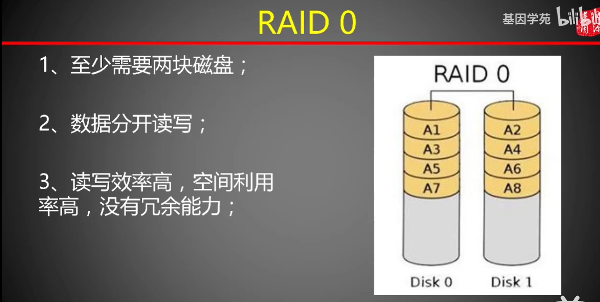
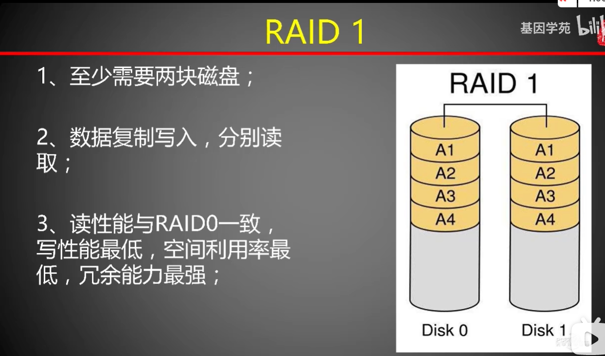
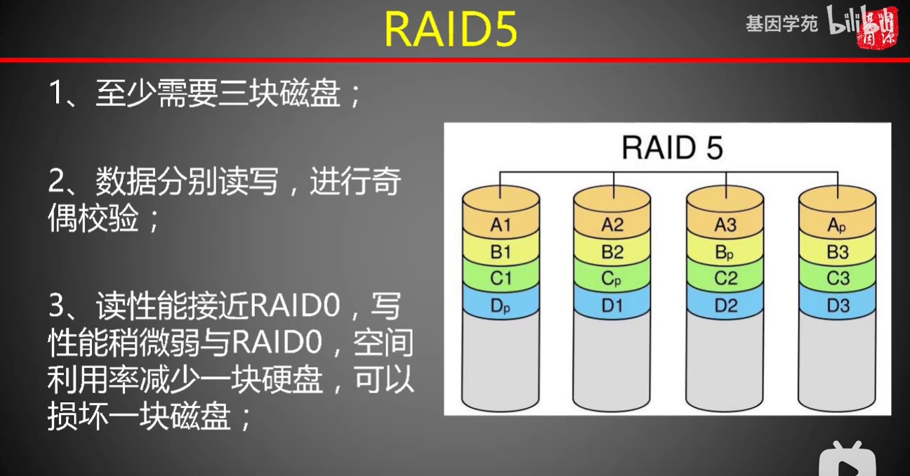
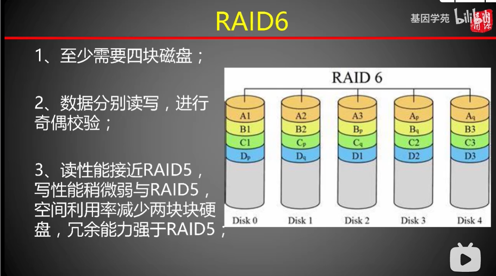
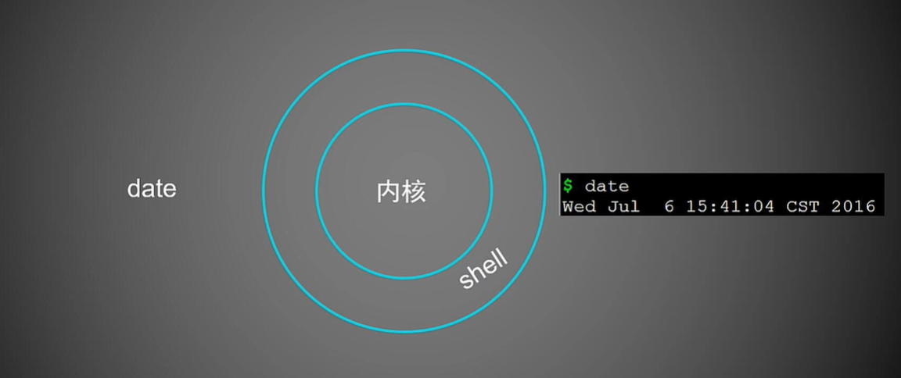
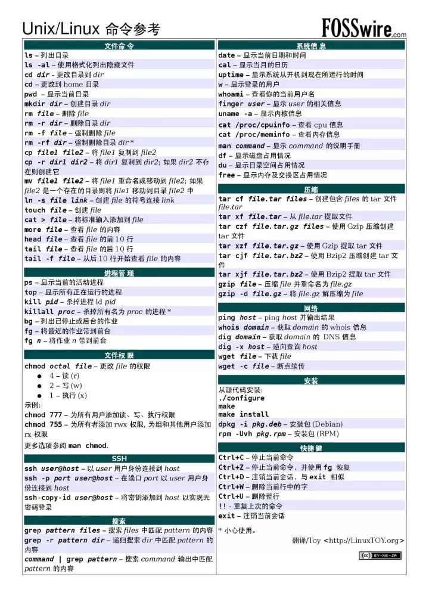

# 学习笔记-生物信息学平台搭建
---

# 目录
~~插入目录~~

---
# 1.平台搭建

## 硬件认识
1. CPU是计算机的大脑，决定计算能力，多核心可进行并行计算
2. 内存是CPU和硬盘交流的媒介，计算机需将存储在硬盘上的数据读取到内存中，CPU才能进行计算，是数据传输的管道
3. 硬盘是数据存储空间，读写速度也可以决定整体性能，是木桶效应的下限

## RAID
1. 通过多块磁盘并行运行形成盘阵来提高计算机的读写能力，在系统上看起来是一个大的磁盘，在**物理硬件层面**上形成比单个物理磁盘更大的存储容量或更高的储存性能，同时提供不同级别数据冗余备份。
2. RAID0

3. RAID1

4. RAID5

5. RAID6

6.  虚拟磁盘
选择好建立RAID所要使用几块磁盘，这个磁盘我们通常称为物理磁盘。选好物理磁盘，制定他们的RAID级别和参数后，RAID组建完成。这个包含多个物理磁盘的虚拟卷我们也叫虚拟磁盘。

> 比如创建的RAID1卷，用了两块500GB的物理磁盘，最后RAID1卷的容量是500GB，RAID1损失50%空间。也可以说我们创建的虚拟磁盘是500GB（RAID1卷）。
> 进入系统后，磁盘管理里面能看到的只有个500GB的磁盘，我们像对待一块磁盘一样可以给他格式化分区，其实这些都是对两块物理磁盘操作的，但是系统下就可以认为是一个磁盘。
> 是两个物理磁盘通过RAID1技术虚拟后，让操作系统认为是一块磁盘，也就是虚拟磁盘。 即通过含有两块磁盘的磁盘组，创建了一个具有RAID1功能的虚拟磁盘。
> 操作系统看见的永远是这个虚拟磁盘，而不知道下层具体有几个物理磁盘。下层通过虚拟化技术，欺骗了上层操作系统，上层看到的是虚拟的磁盘。
> [具体操作](https://www.bilibili.com/video/BV1hM4y1g7D4?p=7)

## 磁盘操作
> - 磁盘分区
> - 磁盘格式化
> - 将不同目录分别挂载到磁盘不同分区
> **可将不同目录挂载同一分区，因为目录多，而主分区只能4个（不用拓展分区和逻辑分区的话）**
> **也可将同一目录挂载到不同分区，用来给文件扩容**
> - 添加磁盘挂载信息到/etc/fstab
  
[原理](https://www.bilibili.com/video/BV1mW411i7Qf?p=7) 为了数据安全和提升效率  
[操作](https://www.bilibili.com/video/BV1hM4y1g7D4?p=12)

## 目录设置
1. 在`/root`根目录下新建`/zhq1`文件，将与系统独立的磁盘挂载到此目录下，后续所有数据分析均在此`/zhq1`目录下完成。  
（后续新加载磁盘及分区可以分别挂载到新建`/zhq2` `/zhq3`等不同目录）
> `mkdir zhq1`

2. 在`/zhq1`下新建（首字母大写表示专用目录）   
`/Datebase`（用来比对的数据库）  
`/Genome`（存放物种基因组数据）   
`/Project`（项目）  
`/Software`（软件）  
`/User`（系统多用户时在此目录下创建不同的用户名）
> `mkdir Datebase Genome Project Software User`  

3. 在`/Software`目录下新建
`/bin`（放置可执行程序或程序的软连接）   
`/biosoft` （软件安装的目录）  
`/src` （存放软件源代码文件）
> `mkdir bin biosoft src`   

4. 在`/Datebase`目录下新建`/nt` `/nr` `/kegg` `/go` `/swissprot` 用来存放不同比对数据库
> `mkdir nt nr kegg go swisssprot`

## 系统环境
禁止加法思维，不能为了适配软件环境而安装了所有的rpm包和perl模块。
1. 会占用系统资源
2. 配置互相可能会兼容性冲突

---
# 准备服务器
1. [虚拟机安装linux](https://www.bilibili.com/video/BV1hb411b7Ng?p=39)  
2. [购买腾讯云](https://www.bilibili.com/video/BV1B5411P7cm?from=search&seid=14649795991467769867&spm_id_from=333.337.0.0)  
3. 后续项目可购买高配置云服务器  
   西柚云共享服务器<https://www.xiyoucloud.net/>    

## 用mobaxterm登陆远程服务器
1. [使用教程](https://www.bilibili.com/video/BV1mJ411J715?spm_id_from=333.999.0.0)
2. 腾讯云、阿里云、虚拟机等账户建议在root下新建普通用户来登录   
3. 购买的服务器账号一般为普通用户，直接登陆使用即可

## shell
实际为用户与计算机内核的接口，通过shell将人类语言翻译成计算机识别的语言后，计算机把结果以用户能看懂的形式输出。**[(shell百科全书)](https://explainshell.com/)**

### shell命令   

## 脚本
1. Scripts直译过来即为剧本，将多命令写到一个文件中，输入数据后自动依次执行脚本内的一条一条命令行。
2. 脚本以sh结尾，如`Scripts.sh`
3. 运行脚本：`sh Scripts.sh` sh+空格+文件名

## 命令行选项和参数
**买菜为命令，买什么菜为选项，买这个菜多少斤为参数**

## 文件传输

### 使用FileZilla传输文件 
[使用教程](https://jingyan.baidu.com/article/0f5fb099e385206d8334eacc.html)
[利用FileZilla从ncbi下载数据](https://blog.csdn.net/xxxie_/article/details/100111979)

## 图形查看工具
安装imagemgick

