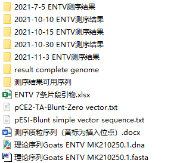

# 遗传进化分析
---

# 目录
~~插入目录~~

## 序列拼接文件准备

## 全基因序列sanger测序结果拼接
1. 在snapgene的理论序列中导入所有**上下游引物和蛋白质features**，将每次测序回来的正反向结果在snapegne中与理论序列文件进行比对，比对成功的序列放在`"测序结果可用序列" `文件夹中
2. 测齐所有片段后，拼接时注意：
   1. snapgene中会显示每段序列比对上理论序列的位置和每个测序碱基的质量，可用来后面在seqman中截去质量不好的序列<https://www.bilibili.com/video/BV1pQ4y1d7Ac?spm_id_from=333.337.search-card.all.click>  
   2. sanger测序结果初步分析<https://www.jianshu.com/p/12fe560c3eaf>
   3. 在seqman中导入可用正反向序列测序结果，结合`步骤1`snapgene比对结果进行截取每一段测序结果前后质量不好的碱基<https://www.bilibili.com/video/BV1pr4y1w7aE/?spm_id_from=333.788.recommend_more_video.0>    
   4. 去除载体序列，进行拼接；注意有冲突时，5'端结果可信度大于3'端的结果可信度<https://wenku.baidu.com/view/2510ca7965ce05087732133d.html>  
   5.  当pcr片段之间重叠区域太少时，用seqman拼接时会断开，可以手动把断开的序列拼接起来<https://www.bilibili.com/video/BV1D44y1B7r8?spm_id_from=333.337.search-card.all.click>
3. 将测序结果的可用正反向序列同时用snapgene和理论序列进行比对用来先**依次拼好**每一段蛋白质features  
注意要**根据文献查询到的全基因蛋白结构**，将全序列的蛋白质features依次拼好，每完成一个包括目标蛋白质feature就要去ncbi进行ORF Finder，最后再来合并成一条完整的全序列<https://mp.weixin.qq.com/s/mI5VBiDrTYhsOSoDwi_hTQ>    
4. 导出拼接好的全基因序列文件  `"Contig"→"Save Consensus"→选择需要的格式保存 `  
5. 导出的fasta文件要在blast中比对<https://www.bilibili.com/video/BV1ZB4y1c7jS?spm_id_from=333.999.0.0>  
   
6.  最后将完整序列去ncbi进行ORF Finder，看ORF区域是否符合蛋白质features预期，不符合预期回到`步骤3 `，再依次重新往下进行   
 
## 确定参考序列
1. 将拼接好的序列去blastn，确定与哪些病毒毒株的序列比对上，用来初步确定要下载哪些参考序列     
2. 下载最新的有价值的文献的参考序列表格（运用好excel文本拆分和转置），然后包括这些文献所研究出来的最新病毒序列也要下载，后续可以根据`步骤1 `的blast结果和初步构建简单的进化树，来确定删除和增加参考序列    
3. 参考基因确定后保存到专门的`数据库文件夹`中,以后此文件中的数据库修改必须谨慎，同时每次分析必须将参考基因从此文件夹中拷贝出来做分析，避免多次操作使数据库中的文件混乱。
  
## 下载参考序列和序列id修改 
1. 

## mafft进行多重序列比对
1. [mafft与其他比对方法的比较](https://www.yuque.com/wusheng/gw7a9p/ibylou)    
2. [mafft各个算法详解](https://www.yuque.com/wusheng/gw7a9p/dslc0k)    
3. 在BioAdier中进行mafft多重序列比对<https://www.yuque.com/wusheng/gw7a9p/woegzw>  

---
【基础分析】
专题一：病毒分类，序列下载，序列格式
1. 病毒分类
2. 病毒序列下载
3. 序列格式解读
4. 序列格式转换

专题二：序列比对原理及应用
1. 打分矩阵
2. 序列比对策略
3. 双序列比对
4. 多序列比对

专题三：基因突变分析、重组和重配分析
1. 病毒基因突变分析
2. 病毒重组和重配分析

专题四：系统发育分析之理论基础篇
1. 认识进化树
2. 分子钟假说
3. p距离与泊松校准
4. 核苷酸进化模型深入剖析
5. 几种建树方法原理详解

专题五：系统发育分析之实战操作篇
1. 建树流程
2. 估算进化模型
3. 系统发育树构建（NJ,ML,BI）
4. 树的查看和美化

专题六：系统发育分析进阶
1. 系统发育信号检测
2. 树拓扑结构比较
3. 多基因联合建树

【高级专题】
专题七：基因选择压力分析
1. 自然选择VS中性进化
2. 枝长模型
3. 位点模型
4. 枝位点模型
5. 进化枝模型
6. PAML进行选择压力分析

专题八：分化时间和进化速率估算
1. 使用Beast估算分化时间和进化速率
2. 使用Treetime估算分化时间和进化速率
3. 使用LSD估算分化时间和平均进化速率

专题九：系统地理发生学分析（病毒时空动态分析）
1. 谱系地理发生学介绍
2. 贝叶斯随机搜索量（BSSVS）分析
3. 结构化溯祖分析

专题十：蛋白质三级结构预测
1. 蛋白质三级结构建模
2. 蛋白质三级结构查看与作图